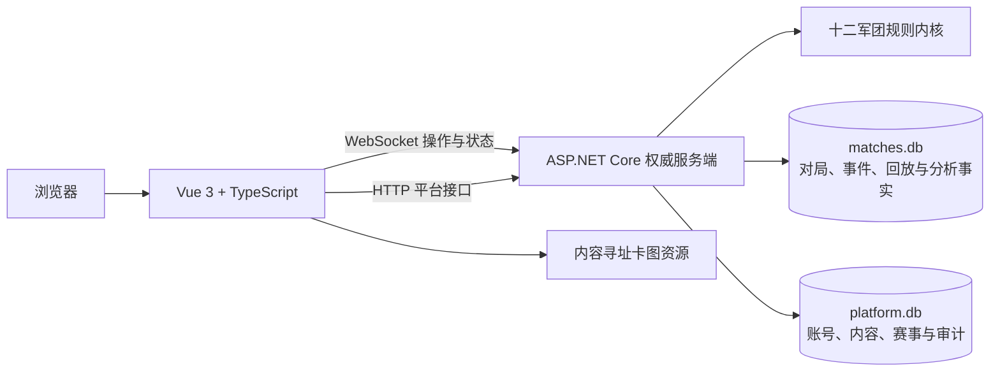

<p align="center">
  
</p>

<h1 align="center">十二军团 Web</h1>

<p align="center">
  《十二军团》的官方网站、卡牌资料库、构筑工具、赛事与在线对战平台
</p>

<p align="center">
  <a href="https://legion-12.com">访问线上站点</a> ·
  <a href="https://github.com/Testrunner-DC/Legion12/actions/workflows/verify-release.yml">查看持续验证</a> ·
  <a href="docs/DEPLOY-HK.md">部署手册</a>
</p>

本项目以 Vue 3 前端和 ASP.NET Core 权威服务端承载《十二军团》的公开内容、规则资料、卡牌档案、牌库、账号、赛事、排位与实时对战。线上站点已经投入使用，源码仍在持续迭代；现行规则以站内规则中心、已审核裁定和当前正式版本为准。

## 当前基线

截至 2026-09-21：

| 项目 | 当前状态 |
| --- | --- |
| 可玩卡牌数据 | 324 张：S1 133 张、S2 115 张、ST 76 张 |
| 画廊与异画 | 42 个展示版本，全部绑定现有规则卡并使用独立编号 |
| 官方预组 | 天廷、太阳城、阿斯加德、高天原、奥林匹斯、彼界，共 6 套 |
| 权威卡效入口 | 324 张均有服务端实战入口；原子化与结构化迁移继续按能力逐项验收 |
| 最近完整规则验证 | 4420/4420 通过，0 失败、0 跳过 |
| 最近平台验证 | 147/147 通过 |
| 前端契约 | 329 项通过，Vue/TypeScript 与生产构建通过 |
| 正式服 | `https://legion-12.com`，HTTP、WebSocket 与版本探针纳入发布验收 |

S3 尚未录入。卡牌档案中出现效果文字不等于某项能力已经完成原子化迁移；准确边界见[卡效与规则内核状态](docs/l12/CARD-EFFECT-STATUS.md)和[逐卡独立审查矩阵](docs/l12/CARD-EFFECT-REVIEW-MATRIX.md)。

## 已实现功能

### 官网与规则中心

- 首页、资讯、产品、视频、站内公告和独立的版本更新日志。
- 规则中心按基础规则、对局流程、关键词、FAQ、单卡裁定、赛事规则和版本记录组织内容。
- 公开规则与裁定先进入后台逐项审核，审核通过后才发布给玩家。
- 站点内容、图片和轮播使用结构化编辑与版本化发布，不依赖直接修改页面源码。

### 卡牌、画廊与构筑

- 统一检索 S1、S2、ST 卡牌，可按阵营、类型、费用、关键词和产品等条件筛选。
- 图鉴、构筑、对战与回放复用同一套卡牌详情呈现。
- 画廊专门展示异画；异画具有独立编号、所属产品和原卡绑定关系。
- 个人牌库、构筑合法性检查、官方预组、牌库码导入导出、牌库图片和牌库广场。
- 玩家获得异画权益后，可在对应卡牌的构筑选项中选择本人使用的卡图，不改变规则与其他玩家的显示。

### 在线对战

- 休闲匹配、排位匹配、好友房、房间码加入和管理员测试沙盒。
- 服务端权威处理阶段、行动、费用、目标、响应、堆叠、持续效果、触发顺序与胜负结算。
- 对局状态按观察者裁剪，手牌、盖伏牌和私密选择不会发送给无权查看的一方。
- 断线重连、同账号连接接管、排位计时、服务器重启恢复和结算幂等对账。
- 桌面宽屏与移动端横屏对战分别适配；移动端操作区、士气选择、卡牌详情和互动弹框使用独立布局协议。
- 对局中的卡面动画、公开日志、重连与回放消费同一权威结果，区分结算、无效、跳过、失败和放弃。

### 排位、赛事与社交

- 赛季、派系、定级、七曜值、段位、称号、排行榜、主宰排行和对阵数据。
- 个人页面展示总体战绩、排位表现、先后手胜率和各主宰独立战绩。
- 好友申请、屏蔽、好友房邀请与账号隐私边界。
- 服务端赛事中心支持创建、报名、牌库快照、裁判、配对、轮次、计时、判罚和赛后档案。
- 排位异常只生成风险信号并进入人工复核；同 IP 不会单独触发处罚。

### 回放与数据

- 玩家可查看 7 天内最近 10 场服务端回放，并导出紧凑 JSON 长期保存。
- 本地 JSON 直接进入播放器，不加入服务器回放列表；历史文件可能随规则版本变化失效。
- 回放复用对战棋盘，支持播放、暂停、步进和公开卡牌详情；移动端提示改用电脑端查看。
- 战绩、排位、主宰统计和卡牌分析使用独立的紧凑事实，不依赖长期保留完整录像。
- 已确认无效的排位对局和禁用账号统一从玩家战绩、排行榜、主宰与卡牌分析中排除，并支持撤销后恢复。

### 账号与管理后台

- 注册、登录、会话管理、改密、强制安全动作、一次自助改名及再次改名申请审批。
- 细粒度角色与权限、持久命令、幂等操作、版本前置条件和管理员审计。
- 站点内容、规则审核、赛事、账号、异画及权益、Bug、对局治理、排位处置和统计分析集中管理。
- 维护计划、即时维护、服务状态、存储用途、发布运行和恢复演练均有独立控制面。

## 规则内核

- 客户端只提交操作意图；服务器保存完整权威状态并验证每一步是否合法。
- `PendingActivation` 保存模式、目标、位置和费用声明，响应结束后按当前状态重新核验，不偷偷改选对象。
- Stack、Prompt、同一时点触发批次、权威事件和检查点共同支持复杂卡效、断线恢复与回放。
- 冒号前费用与冒号后效果严格分离：效果被无效或目标失效时，已支付费用不会自动退回。
- 卡效优先迁入共享规则和结构化能力档案，禁止以新的逐卡卡号分支或运行时卡文推断代替规则建模。
- 自动门禁覆盖 324 张卡的能力清单、卡图、旧入口、私密信息、响应窗口、恢复和展示一致性。

## 技术架构



- 前端：Vue 3、TypeScript、Vite、Vue Router、Tailwind CSS、GSAP。
- 服务端：.NET 10、ASP.NET Core HTTP/WebSocket、Microsoft.Data.Sqlite。
- 数据：S1/S2/ST 卡牌 JSON、官方预组、SQLite 权威存储及受控兼容镜像。
- 发布：本地或 CI 完成完整验证，服务器校验预构建包后原子切换；相同卡图哈希直接复用。

## 本地运行

### 环境要求

- Node.js 22+
- npm 10+
- .NET SDK 10.0.302+；仓库通过 `global.json` 锁定功能带
- PowerShell 7+，用于统一验证和发布脚本
- Chrome 或 Edge；回放和完整开发验收优先使用桌面端

### 启动服务端

在仓库根目录运行：

```powershell
dotnet run --project ".\服务端WebSocket\GrandUMIServer.csproj"
```

默认 HTTP 地址为 `http://localhost:8080`，WebSocket 为 `ws://localhost:8080/ws`，健康接口为 `http://localhost:8080/health`。

### 启动前端

另开终端：

```powershell
cd .\opcgpro-vue
npm ci
npm run dev
```

浏览器打开 `http://localhost:5173`。本机默认连接 `ws://localhost:8080/ws`，可使用两个独立浏览器会话测试双人房间。

局域网或独立服务端调试时，可在启动前显式设置：

```powershell
$env:VITE_WS_URL = "ws://<服务器地址>:8080/ws"
npm run dev
```

## 验证

按改动阶段使用统一入口：

```powershell
pwsh -File .\scripts\verify-l12-change.ps1 -Level Focused
pwsh -File .\scripts\verify-l12-change.ps1 -Level Batch
pwsh -File .\scripts\verify-l12-change.ps1 -Level Release
```

- `Focused`：开发中的相关测试与静态守卫。
- `Batch`：一个完整功能或同类 Bug 批次完成后的规则、平台与前端验证。
- `Release`：干净提交在推送或获准部署前的完整发布验证与制品生成。

也可以分别运行：

```powershell
dotnet test ".\TwelveLegions.Tests\TwelveLegions.Tests.csproj"
dotnet test ".\TwelveLegions.Platform.Tests\TwelveLegions.Platform.Tests.csproj"

cd .\opcgpro-vue
npm run build
```

GitHub Actions 会在 `main`、Pull Request 和手动触发时执行发布级验证，并生成可供服务器校验的 Linux 预构建产物。

## 目录结构

```text
Legion12/
├─ opcgpro-vue/                   Vue 前端、官网、构筑与对战界面
├─ 服务端WebSocket/                ASP.NET Core 服务端与规则内核
├─ TwelveLegions.Tests/           规则、卡效、房间与对局回归
├─ TwelveLegions.Platform.Tests/  账号、平台、后台、赛事与存储回归
├─ scripts/                       验证、审计、数据与资源工具
├─ ops/                           发布、服务器和 Nginx 运维脚本
└─ docs/                          规则、架构、审计、测试与交接记录
```

## 关键文档

- [协议与消息结构](docs/PROTOCOL.md)
- [UI 架构](docs/UI-ARCHITECTURE.md)
- [规则书逐页审计](docs/RULEBOOK-AUDIT.md)
- [FAQ 与裁定索引](docs/l12/FAQ-RULINGS.md)
- [卡效与规则内核状态](docs/l12/CARD-EFFECT-STATUS.md)
- [卡效原子化架构](docs/l12/ATOMIC-EFFECTS.md)
- [回归夹具与验证边界](docs/REGRESSION-FIXTURES.md)
- [Bug 修复记录](docs/BUGFIX-REGISTRY.md)
- [赛事中心与学习游玩规划](docs/l12/TOURNAMENT-AND-LEARN-TO-PLAY-PLAN.md)
- [服务器存储治理](docs/SERVER-STORAGE-MAINTENANCE.md)
- [协作与批次流程](docs/WORKSTREAM-COORDINATION.md)
- [正式服部署](docs/DEPLOY-HK.md)

## 开发与发布约束

1. 修复前先核对现有差异、历史 Bug 记录和相关规则。
2. 卡牌问题必须扫描完整卡池中的同时点、同费用、同目标和同区域模式，优先修复共享根因。
3. 每个修复都要增加规则测试、平台测试、UI 契约、数据不变量或资产守卫。
4. 不把真实玩家身份、令牌、私密手牌、房间秘密或生产数据提交到仓库。
5. 推送代码不等于获准部署；正式部署、服务重启和数据清理需要当批明确授权。
6. 每次成功部署都在站内原“更新日志”入口发布玩家可见变更，不把后台、审核、审计或存储细节写入玩家日志。

完整协作规则见 [AGENTS.md](AGENTS.md)。

## 正式服部署

拥有正式服权限的维护者，可从干净且与 `origin/main` 一致的提交执行：

```powershell
pwsh -File .\ops\windows\deploy-l12.ps1
```

脚本默认使用当前正式制品目录 `/www/legion12`，会复用已经验证的发布包和相同哈希的卡图资源。服务器只负责校验、备份、原子切换和 HTTP/WebSocket 验收，不在生产机重新编译源码。完整的 SSH 信任、目录、回滚和维护边界见[正式服部署手册](docs/DEPLOY-HK.md)与[伙伴提交及发布指南](docs/CONTRIBUTION-AND-PRODUCTION-RELEASE.md)。

## 来源与使用边界

- 项目早期参考了 [GrandUMI](https://github.com/corazon1999/GrandUMI) 的部分网页组织与工程思路；GrandUMI 运行时代码、卡图、历史对局和测试体系现已退出本项目依赖。
- 规则与卡牌资料依据项目内规则书、FAQ 和已审核裁定整理，术语以《十二军团》现行规则为准。
- 仓库中的游戏名称、卡牌文字、图片和标识可能涉及其权利人的知识产权。
- 本仓库当前没有声明可用于商业分发的许可证；公开再分发或商业使用前，应分别确认程序代码与游戏素材的授权。

---

项目仓库：[Testrunner-DC/Legion12](https://github.com/Testrunner-DC/Legion12)
