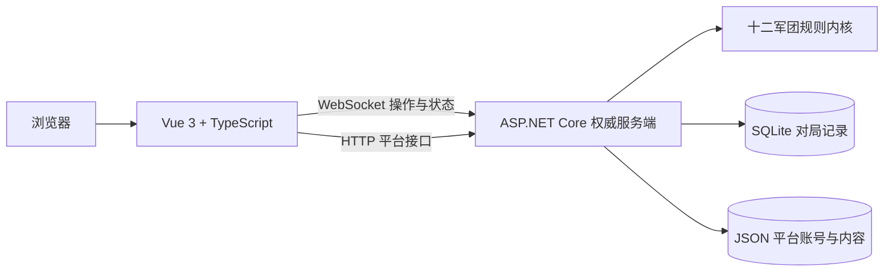

<p align="center">
  
</p>

# 十二军团 Web

面向《十二军团》的开发中网页平台，目标同时承载官方网站、资讯与规则资料库、卡牌档案、牌库工具、赛事中心和服务器权威判定的在线对战。

> 当前仍是开发与内测阶段。卡牌档案中存在效果文字，不代表对应卡效已经完整进入服务端规则层；准确进度以[卡效与规则内核状态](docs/l12/CARD-EFFECT-STATUS.md)和自动测试为准。

## 当前基线

| 项目 | 当前状态 |
| --- | --- |
| 卡牌资料 | S1 133 张、S2 115 张，共 248 张 |
| 官方预组 | 天廷、高天原、太阳城、阿斯加德、奥林匹斯、彼界，共 6 套 |
| 服务端规则回归 | 191/191 通过 |
| 前端 UI 契约 | 41/41 通过 |
| 前端生产构建 | TypeScript、Vue 与 Vite 构建通过 |
| 当前主要范围 | S1/S2；S3 暂未录入 |

## 产品功能

| 功能域 | 已实现 | 尚未接入或仍在完善 |
| --- | --- | --- |
| 官方主页 | 首页、资讯、规则中心、FAQ、更新内容和统一左侧导航 | 正式内容发布流程与线上资源托管 |
| 卡牌档案 | S1/S2 查询，按阵营、类型、费用、天灾等级等筛选；卡面与详情查看 | S3 数据与更多权威裁定 |
| 牌库 | 构筑校验、6 套官方预组、我的牌库、牌库广场、牌库码导入导出、16:9 牌库图 | 牌库广场目前以本地开发数据为主，社区服务端同步待接入 |
| 对战大厅 | 房间码建房/加入、房间规则、准备、观战设置、单人测试入口 | 公开排位和休闲匹配服务尚未接入 |
| 在线对战 | 双人 WebSocket 对战、服务端权威判定、局内对话、投降、在线状态和 Bug 反馈 | 仍在持续逐卡验收和移动端适配 |
| 对局记录 | SQLite 永久记录、实战棋盘只读回放、JSON 回放导入导出 | 云端记录与跨设备同步 |
| 账号与后台 | 注册、登录、改密、角色权限、恶意用户名阻止、主页内容和 Bug 管理 | 多实例数据库、完整审计和正式运营后台 |
| 赛事中心 | 创建、报名、裁判、配对、轮次、计时、判罚和赛后档案的前端工作流 | 当前主要保存在浏览器；共享赛事服务和真实房间编排待接入 |
| 好友、排行榜、沙盒 | 好友/排行榜页面结构；复用正式规则内核的单人测试沙盒、服务器权威 GM 面板、SQLite 记录与 JSON 导出 | 好友关系和排行榜统计服务尚未接入 |

## 对战与规则内核

- C# 服务端保存完整权威状态，客户端只提交操作意图并渲染按观察者裁剪后的状态。
- 支持起手、调度、阶段流转、士气支付、2×3 战场、部署、移动、骑兵位移、进攻、抵挡、支援、伤害、阵亡和胜负判定。
- 支持 `PendingActivation`、目标/模式/位置预声明、响应窗口、堆叠、同一时点触发批次、持续效果与派生兵力重算。
- 管理后台可查看 248 张卡的原子化能力组合、流程图、参数与迁移状态；已验证能力由同一原子程序接管实战，未迁移能力保留显式旧实现兜底。
- 支持主动战术、反击战术、覆盖与隐匿，并区分公开信息、己方私有信息和对手隐藏信息。
- 支持天灾准备、禁用、随机公开、玩家选用、天灾触发与最终天灾〈堙灭〉。
- 已建立各阵营专属机制：太阳城陵墓守卫与卡诺匹斯、彼界试炼与符文、奥林匹斯士气/神力与晋升，以及伊西斯特殊胜利等。
- S1/S2 卡效仍按规则书、FAQ 和同类效果框架持续审计；未完成项不会仅因档案存在文字而标记为完成。

## 技术架构



- 前端：Vue 3、TypeScript、Vite、Vue Router、Tailwind CSS、GSAP。
- 服务端：.NET 10、ASP.NET Core WebSocket/HTTP、Microsoft.Data.Sqlite。
- 数据：S1/S2 卡牌 JSON、官方预组 JSON、SQLite 对局快照和本地平台数据。
- UI：参考 GrandUMI 的信息架构与交互密度，使用十二军团自己的视觉系统、术语和素材。

## 本地启动

### 环境要求

- Node.js 22+
- npm 10+
- .NET SDK 10.0.302+（仓库通过 `global.json` 锁定 .NET 10 功能带）
- Chrome 或 Edge；桌面端建议分辨率不低于 1366×768

### 1. 启动服务端

在仓库根目录执行：

```powershell
dotnet run --project ".\服务端WebSocket\GrandUMIServer.csproj"
```

服务端默认监听 `0.0.0.0:8080`，WebSocket 地址为 `ws://localhost:8080/ws`，健康检查为 `http://localhost:8080/health`。

### 2. 启动前端

另开一个终端：

```powershell
cd .\opcgpro-vue
Copy-Item .env.example .env.local
npm ci
npm run dev
```

浏览器打开 `http://localhost:5173`。同机可使用两个浏览器会话测试双人房间。

局域网测试时，让其他玩家打开 `http://<主机IP>:5173`，并将 `.env.local` 中的地址改为：

```dotenv
VITE_WS_URL=ws://<主机IP>:8080/ws
```

## 验证

在仓库根目录运行后端规则回归：

```powershell
dotnet test ".\TwelveLegions.Tests\TwelveLegions.Tests.csproj"
```

运行前端 UI 契约、类型检查和生产构建：

```powershell
cd .\opcgpro-vue
npm run build
```

服务端启动后可运行双客户端 WebSocket 冒烟测试：

```powershell
node .\scripts\ws-smoke.mjs
```

最新验证证据见[测试记录](docs/TEST-REPORT.md)。

## 数据与接口

- 对局记录：服务端输出目录 `runtime/matches.db`。
- 平台账号、内容和 Bug：服务端输出目录 `runtime/platform.json`。
- 对局接口：`GET /api/matches`、`GET /api/matches/{matchId}`。
- 账号接口：`/api/auth/register`、`/api/auth/login`、`/api/auth/me`、`/api/auth/change-password`。
- Bug 与后台接口：`/api/bugs`、`/api/admin/*`。
- 以上运行数据均被 `.gitignore` 排除，不应提交到仓库。

## 目录结构

```text
Legion12/
├─ opcgpro-vue/             Vue 前端、官网与对战界面
├─ 服务端WebSocket/          ASP.NET Core 服务端与规则内核
├─ TwelveLegions.Tests/     十二军团规则和平台回归测试
├─ scripts/                 数据同步、资源审计与联机冒烟脚本
└─ docs/                    协议、规则审计、卡效状态和修复记录
```

## 关键文档

- [协议与消息结构](docs/PROTOCOL.md)
- [UI 架构](docs/UI-ARCHITECTURE.md)
- [规则书逐页审计](docs/RULEBOOK-AUDIT.md)
- [FAQ 与裁定索引](docs/l12/FAQ-RULINGS.md)
- [卡效与规则内核状态](docs/l12/CARD-EFFECT-STATUS.md)
- [卡效原子化架构](docs/l12/ATOMIC-EFFECTS.md)
- [Bug 修复记录](docs/BUGFIX-REGISTRY.md)
- [赛事中心与学习游玩规划](docs/l12/TOURNAMENT-AND-LEARN-TO-PLAY-PLAN.md)
- [测试记录](docs/TEST-REPORT.md)

## 开发约束

本项目将本地工作区视为唯一事实来源，并执行以下防回滚流程：

1. 修复前先检索历史修复记录与当前差异。
2. 修复一个卡牌问题时，扫描完整 S1/S2 卡池和公共处理器中的同类型效果。
3. 优先修复公共根因，再迁移所有命中卡牌。
4. 每次修复增加服务端测试、UI 契约、数据不变量或构建检查。
5. 修改后复查完整差异，不以远端版本覆盖本地累计成果。

完整规则见 [AGENTS.md](AGENTS.md)。

## 来源与使用边界

- 架构参考：[GrandUMI](https://github.com/corazon1999/GrandUMI)。
- 规则与卡牌资料参考项目内规则书、FAQ 和[十二军团卡牌查询](https://twelve-legions-card-lookup.pages.dev)。
- GrandUMI 的卡图和历史对局没有迁入；仅学习其页面结构、网络组织和卡效工程方式。
- 本仓库包含的游戏名称、卡牌文字、图片和标识可能涉及其权利人的知识产权。
- 当前仓库未声明可用于商业分发的许可证；公开部署或商业使用前，应分别确认模板代码与游戏素材的授权。

## 香港测试服部署

拥有服务器 SSH 权限的开发者，可以从干净且已同步的 `main` 分支执行一键部署：

```powershell
powershell -ExecutionPolicy Bypass -File .\ops\windows\deploy-l12.ps1
```

部署采用预构建产物：完整测试与构建只执行一次，服务器只校验哈希、迁移共享运行数据、原子切换版本并做冒烟检查；同版本卡图缓存不会重复上传。可先单独执行 `ops/windows/verify-l12.ps1`，首次使用、GitHub Actions、干运行、数据保留和回滚说明见 [香港测试服部署文档](docs/DEPLOY-HK.md)。

---

项目仓库：[Testrunner-DC/Legion12](https://github.com/Testrunner-DC/Legion12)
